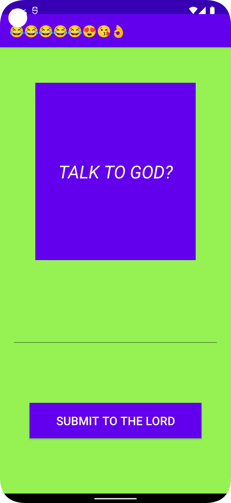

## Rapport

Det första som gjordes var att lägga till en ImageView, en EditText och en Button i
`activity_main.xml`

`<ImageView/><EditText/><Button/>`

Jag valde att använda mig av constraint layout och behövde därför inte ändra någon layout i `activity_main.xml`
Det lades till constraints och margins till alla vyer/knappar/textfält. Det lades även till element
av design så som färger och textstorlek med mera. Det lades till egna färger i `colors.xml` och
namnet ändrades i `strings.xml`

Efter det lades det till en TextView i `activity_main.xml` som fick constraints så att den hamnade i
mitten av ImageView

`<TextView
app:layout_constraintBottom_toBottomOf="@+id/imageView"
app:layout_constraintEnd_toEndOf="@+id/imageView"
app:layout_constraintStart_toStartOf="@+id/imageView"
app:layout_constraintTop_toTopOf="@+id/imageView" />`

Den fick även lite design element så som annan textstorlek, annan färg och blev även kursiv. Sedan
så lektes det runt lite, ändrade margins och constraints, textstorlek och färg.

